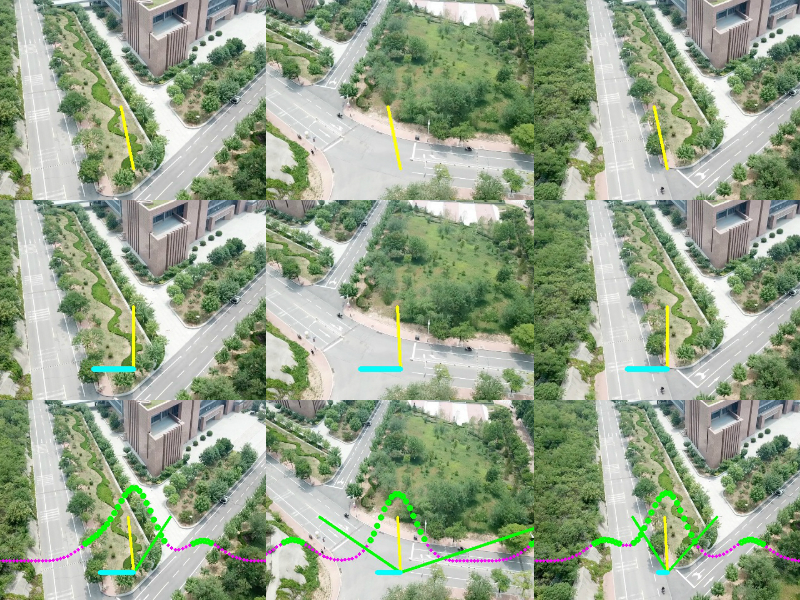

## Learn by Observation: Imitation Learning for Drone Patrolling from Videos of A Human Navigator
This is the code mentioned in the article that calculates the performance of three on our validation set.


## Get Start

### Requirements
This code has been tested on Ubuntu 18.04, and on Python 3.6.  
Dependencies:
* TensorFlow 1.15.0
* Keras 2.2.4
* Keras-contrib 2.0.8
* tensorflow-estimator         
* tensorflow-probability          
* tensorflow-tensorboard
* NumPy
* OpenCV
* scikit-learn
* Python gflags

### Usage
1. Run the test code, there are `predict_UAVPatrolNet.py`,`predict_DroNet.py`and`predict_TrailNet.py`
    ```
    python predict_whichNet.py [Flags]
    ```
    Check configuration parameters in `common_flags.py`  
2. Run the accuracy calculation code, there are`evaluate_UAVPatrolNet.py`,`evaluate_DroNet.py`and`evaluate_TrailNet.py`
    ```
    python evaluate_whichNet.py [Flags]
    ```